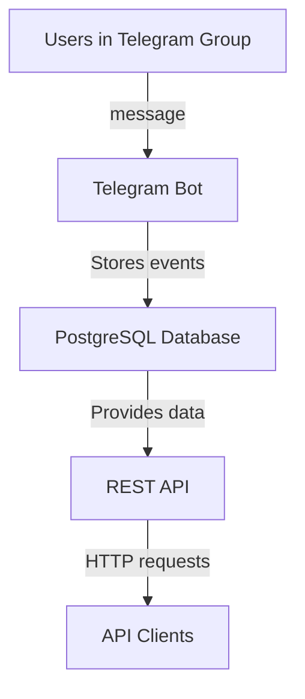

# Telegram Group Logger 

**Цель проекта** — создать простого и понятного Telegram‑бота, который:
- собирает сообщения из групп, в которые он добавлен;
- сохраняет максимум информации в базу данных PostgreSQL;
- предоставляет REST API для выборки сообщений за определённый период времени.
- p.s. делаем простую реализацию без брокеров токенов и другой лабуды (оставим на расширение пока МВП)
  
---

## 📐 Архитектура процесса



### Подробное описание шагов
1. **Пользователи** пишут сообщения в Telegram‑группе.
2. **Telegram Bot** слушает обновления через long polling:
   - получает новые сообщения и события редактирования;
   - извлекает данные о сообщении, пользователе, чате;
   - сохраняет полное содержимое (включая JSON от Telegram) в базу.
3. **PostgreSQL** хранит все данные в таблице `messages` с индексами.
4. **REST API** предоставляет доступ к сохранённым сообщениям:
   - запрос `/messages` фильтрует данные по периоду времени и `chat_id`;
   - документация доступна на `/docs`.
5. **Клиенты API** (разработчики, аналитики, приложения) запрашивают данные через HTTP.

---
Всё разворачивается через Docker Compose

## 🚀 Запуск проекта

### 1. Клонировать репозиторий
```bash
git clone <URL_РЕПОЗИТОРИЯ> telegram-group-logger
cd telegram-group-logger
```

### 2. Настроить окружение
Создать `.env` файл на основе `.env.example`:
```bash
cp .env.example .env
```
Указать в нём токен бота (`BOT_TOKEN`).
Указать настройки PostreSQL

### 3. Добавить бота
- Добавить бота в группу, где нужно сохранять сообщения

### 4. Запустить контейнеры
```bash
docker compose up -d --build
```

После запуска будут доступны:
- REST API: [http://localhost:8000](http://localhost:8000)
- Документация: [http://localhost:8000/docs](http://localhost:8000/docs)
- PostgreSQL: `localhost:5432` (если включён проброс порта)

---

## 🧪 Примеры использования API

Получить сообщения за период:
```bash
curl "http://localhost:8000/messages?from=2025-01-01T00:00:00Z&to=2030-01-01T00:00:00Z&limit=10"
```

Проверить состояние сервера:
```bash
curl http://localhost:8000/health
```

Открыть документацию:
```
http://localhost:8000/docs
```

---

## 🛠️ Технологии
- **Telegram Bot** — ?
- **API** — FastAPI
- **База данных** — PostgreSQL
- **Контейнеризация** — Docker + Docker Compose
- **Документация** - ?

---

## 🧭 Возможные улучшения
- ?
- ?
- ?
---

